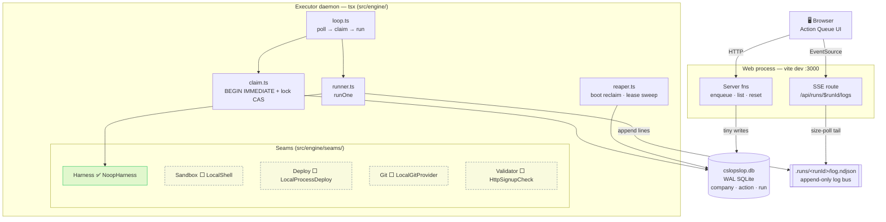
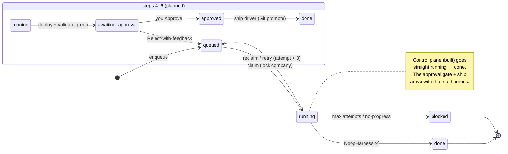
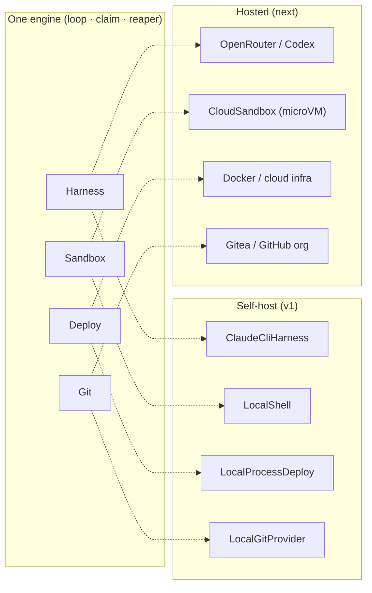

# Architecture — run-executor spine

> Diagrams are [Mermaid](https://mermaid.js.org/) — they render natively on GitHub and in VS Code (install the "Markdown Preview Mermaid Support" extension). Edit the fenced ` ```mermaid ` blocks as plain text.

## Process topology

Two OS processes coordinate through **one WAL SQLite file** (queue/lease/lock state) and **per-run NDJSON log files** (the log bus). No sockets, no IPC.



Legend: **✅ implemented** · **⬜ interface only** (local impls land in build steps 4–6).

Key rules encoded above:
- The **executor** is a separate `tsx` process (survives Vite HMR; keeps synchronous SQLite + minutes-long subprocess supervision off the HTTP/SSR loop).
- The **claim** is one `BEGIN IMMEDIATE` transaction doing sub-millisecond writes only; all build/deploy/agent work runs *outside* it. A company-lock CAS (`UPDATE … WHERE locked_by_run_id IS NULL`) is the cross-process guard.
- The **web process is write-minimal** — it never spawns subprocesses, so the synchronous `busy_timeout` wait can't stall HTTP/SSE.
- **Crash recovery** = replay from the git-sha checkpoint; boot reclaims every `running` run left by a dead executor.

## Run + action state machine



Today's control plane (NoopHarness) runs `queued → running → done`; the `awaiting_approval → approved → ship` path is wired into the schema (`action.status` enum) but activated in steps 5–6 when the real build → deploy → validate exists.

## Deployment placements — one engine, two homes

The seams exist so the **local open-core** and the **hosted multi-tenant** product are the same engine with different implementations injected at each boundary.



Swapping self-host → hosted means injecting the right-hand implementations at each seam — the run loop never changes.
